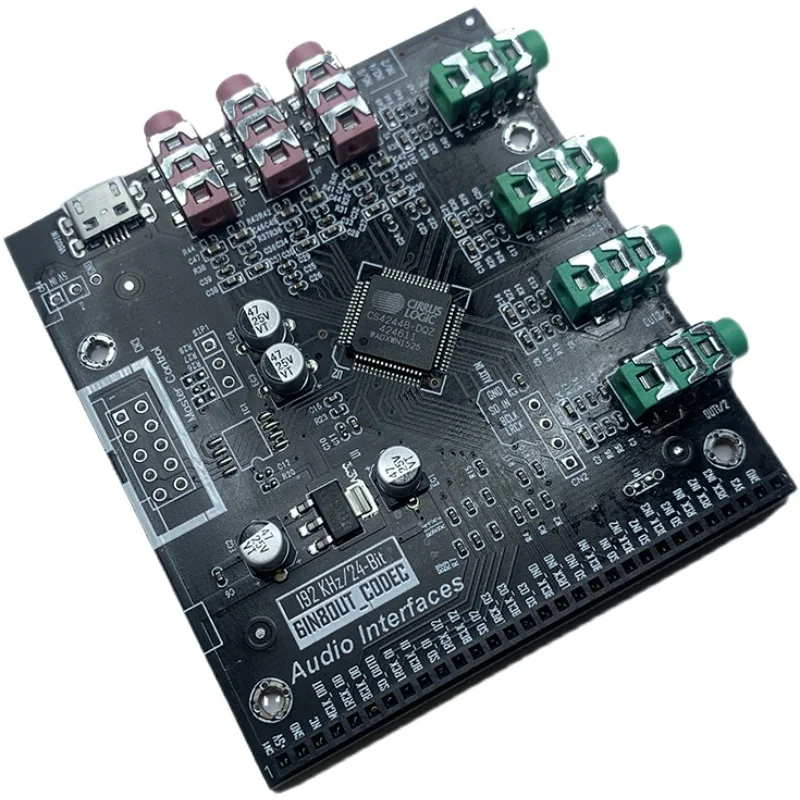

# RockPi S setup for CS42448 DAC board

Device Tree overlay and Kernel patches required for CS42448 DAC to work with RockPi S SBC

CS42448 is relatively cheap but powerful multichannel DAC/ADC

The CS42448 CODEC provides six multi-bit analog-to-digital and eight multi-bit digital-to-analog delta-sigma converters.

- Six 24-bit A/D, Eight 24-bit D/A Converters
- System Sampling Rates up to 192 kHz
- Compatible with TDM Serial Interface
- Programmable ADC High-Pass Filter for DC
- Offset Calibration
- Logarithmic Digital Volume Control
- I2CTM & SPITM Host Control Port
- Supports Logic Levels Between 5 V and 1.8 V

Google it `6IN8OUT_CODEC` or search on Aliexpress for `ADU1452 CS42448 CODEC`.
You don't need ADU1452 hat, only CS DAC board and it's relatively cheap, around 28-30$

### Requirements

This setup has been tested and proven to work with:
- RockPi S board revision v1.3
- [Radxa Kernel](http://https://github.com/radxa/kernel.git "Radxa Kernel") v4.4.143 `stable-4.4-rockpis` branch
